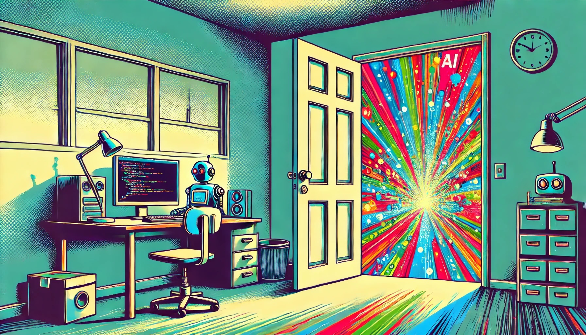

# From Software Engineering to AI Data Scientist

## For software engineers exploring a career move into Data Science, GenAI, LLMs

This is code to accompany my course on transitioning from a technical career to AI Data Science.  

**Essential links:**    
1. The course [resources](https://edwarddonner.com/2024/10/16/from-software-engineer-to-ai-data-scientist-resources/)
2. I'm running a number of [Live Events](https://www.oreilly.com/search/?q=author%3A%20%22Ed%20Donner%22) with O'Reilly and Pearson
3. My 8 week action-packed course on [mastering LLM engineering](https://www.udemy.com/course/llm-engineering-master-ai-and-large-language-models/?referralCode=35EB41EBB11DD247CF54)
4. If you'd like to stay in touch, I'm multi-modal... please [connect](https://www.linkedin.com/in/eddonner/) with me on LinkedIn, [follow](https://x.com/edwarddonner) me on X, and [subscribe](https://www.youtube.com/@Edward.Donner) to my YouTube channel!

### A note before you begin

I'm here to help you be most successful with your learning! If you hit any snafus, or if you have any ideas on how I can improve the course, please do reach out on LinkedIn or by emailing me direct (ed@edwarddonner.com). It's always great to connect with people on LinkedIn to build up the community - you'll find me here:  
https://www.linkedin.com/in/eddonner/

### An important point on API costs

During the course, I'll suggest you try out the leading models at the forefront of progress, known as the Frontier models. I'll also suggest you run open-source models using Google Colab. These services have some charges, but I'll keep cost minimal - like, a few cents at a time.

Please do monitor your API usage to ensure you're comfortable with spend; I've included links below. There's no need to spend anything more than a couple of dollars for the entire course.

### How this Repo is organized

There are folders for each of the "segments", representing modules of the class, culminating in a powerful autonomous Agentic AI solution in Segment 4.  
Follow the setup instructions below, then open the segment 1 folder and prepare for joy.

### The most important part

The best way to learn is by **DOING**. You should work along with me, running each cell, inspecting the objects to get a detailed understanding of what's happening. Then tweak the code and make it your own. I'd love it if you wanted to push your code so I can follow along with your progress, and I can make your solutions available to others so we share in your progress. While the projects are enjoyable, they are first and foremost designed to be _educational_, teaching you business skills that can be put into practice in your work.

## Pre-setup - installing Ollama for local inference

### Important note: see my warning about Llama3.3 below - it's too large for home computers! Stick with llama3.2! Several students have missed this warning...

We will start the course by installing Ollama so you can see results immediately!
1. Download and install Ollama from https://ollama.com noting that on a PC you might need to have administrator permissions for the install to work properly
2. On a PC, start a Command prompt / Powershell (Press Win + R, type `cmd`, and press Enter). On a Mac, start a Terminal (Applications > Utilities > Terminal).
3. Run `ollama run llama3.2` or for smaller machines try `ollama run llama3.2:1b` - **please note** steer clear of Meta's latest model llama3.3 because at 70B parameters that's way too large for most home computers!  
4. If this doesn't work: you may need to run `ollama serve` in another Powershell (Windows) or Terminal (Mac), and try step 3 again. On a PC, you may need to be running in an Admin instance of Powershell.  
5. And if that doesn't work on your box, I've set up this on the cloud. This is on Google Colab, which will need you to have a Google account to sign in, but is free:  https://colab.research.google.com/drive/1-_f5XZPsChvfU1sJ0QqCePtIuc55LSdu?usp=sharing

Any problems, please contact me!

## Setup instructions

Hopefully I've done a decent job of making these guides bulletproof - but please contact me right away if you hit roadblocks:

- PC people please follow the instructions in [SETUP-PC.md](SETUP-PC.md)
- Mac people please follow the instructions in [SETUP-mac.md](SETUP-mac.md)
- Linux people, the Mac instructions should be close enough!

### Starting in Segment 3, we'll also be using Google Colab for running with GPUs

You should be able to use the free tier or minimal spend to complete all the projects in the class. I personally signed up for Colab Pro+ and I'm loving it - but it's not required.

Learn about Google Colab and set up a Google account (if you don't already have one) [here](https://colab.research.google.com/)

The colab links are in the Segment folders.

### Monitoring API charges

You can keep your API spend very low throughout this course; you can monitor spend at the dashboards: [here](https://platform.openai.com/usage) for OpenAI, [here]

## And that's it! Happy coding!

Please do message me or email me at ed@edwarddonner.com if this doesn't work or if I can help with anything. I can't wait to hear how you get on.
